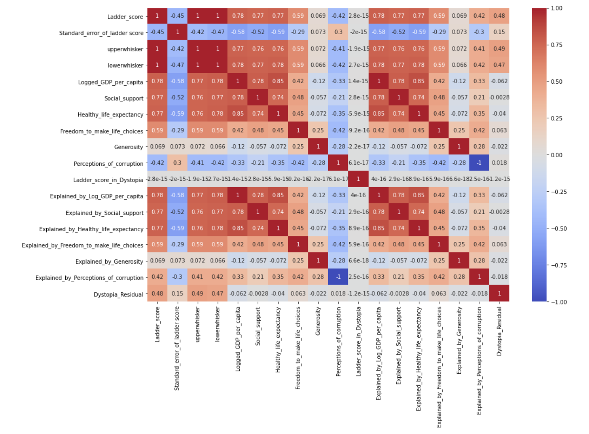

# About dataset.

The World Happiness Report is a landmark survey of the state of global happiness. The happiness scores and rankings use data from the Gallup World Poll. The scores are based on answers to the main life evaluation question asked in the poll. This question, known as the Cantril ladder, asks respondents to think of a ladder with the best possible life for them being a 10 and the worst possible life being a 0 and to rate their own current lives on that scale. The scores are from nationally representative samples for the years 2013-2016 and use the Gallup weights to make the estimates representative. The columns following the happiness score estimate the extent to which each of six factors – economic production, social support, life expectancy, freedom, absence of corruption, and generosity – contribute to making life evaluations higher in each country than they are in Dystopia, a hypothetical country that has values equal to the world’s lowest national averages for each of the six factors. They have no impact on the total score reported for each country, but they do explain why some countries rank higher than others.

## Actions taken:

· Converted data into actionable insights by cleaning and visualizing outcomes. 
· Combined the data from 5 datasets to plot a correlation map and analyze the happiness score of 153 countries.
   
· Built predictive models and evaluated them using 7 different ML classification and regression algorithms to predict the happiness score for year 2020. 
· Implemented Random Forest Regressor algorithm to improve the forecast accuracy to ~75%.

<!--  -->
<!--  -->

